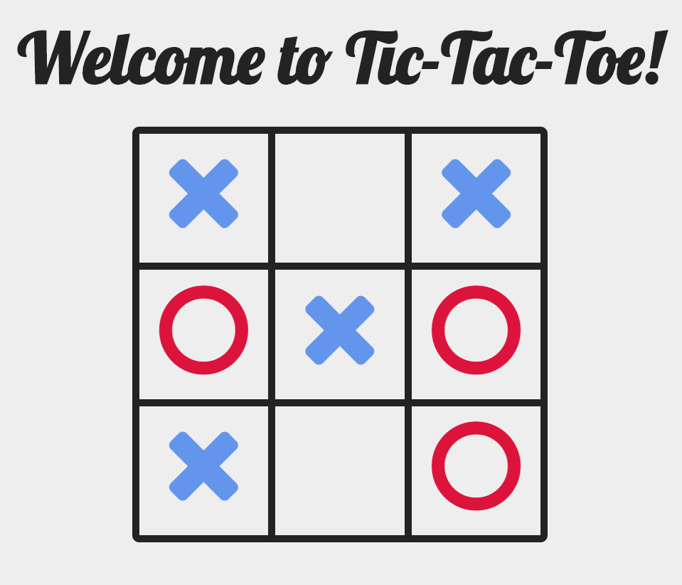

# Tic Tac Toe

Simple Tic-Tac-Toe game made with my [Web App Boilerplate](https://github.com/zbowhay/web-app-boilerplate).


<b>Live Demo:</b> <i>https://zbowhay.github.io/WebAppDev/tic-tac-toe.html</i>

### Features
 - Angular 5
 - Font-Awesome Icons for player moves
 - Responsive UI
 - Ava & Webpack 

### Usage
```sh
--- builds ---
$ npm run build
$ npm run build:dev

--- development ---
tab 1: $ npm run serve
tab 2: $ node server.js

--- test production build ---
$ npm start

--- testing ---
$ npm test
$ npm test:detailed
```

### Preview
<!--  -->
